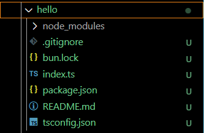
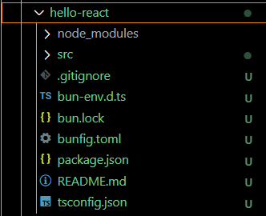

# 安裝方式
### 官網[ https://bun.sh ]
### 執行安裝指令
<table>
    <tr>
        <th style="text-align: left;">Linux環境</th>
        <td>curl -fsSL https://bun.sh/install | bash</td>
    </tr>
    <tr>
        <th style="text-align: left;">Windows環境(cmd)</th>
        <td>powershell -c "irm bun.sh/install.ps1 | iex"</td>
    </tr>
     <tr>
        <th style="text-align: left;">Windows環境(powershell)</th>
        <td>"irm bun.sh/install.ps1 | iex"</td>
    </tr>
</table>

1. 在 C:\Users\abab0\\.bun\bin\ 下產生 bun.exe、bunx.exe
2. 可重複執行安裝指令
3. 要設定一下環境變數 bun
3.1 系統變數 - 新增
3.2 新增系統變數

<table>
    <tr>
        <th style="text-align: left;">變數名稱</th>
        <th style="text-align: left;">變數值</th>
    </tr>
    <tr>
        <th style="text-align: left;">bun</th>
        <td>C:\Users\abab0\.bun\bin\bun.exe</td>
    </tr>
    <tr>
        <th style="text-align: left;">bunx</th>
        <td>C:\Users\abab0\.bun\bin\bunx.exe</td>
    </tr>
</table>

### 檢查是否安裝成功
◇ 安裝完成後，檢查是否安裝成功(cmd)
<table>
    <tr>
        <th style="text-align: left;">Linux環境</th>
        <td>bun --version</td>
        <td style="text-align: right;">1.2.9</td>
    </tr>
    <tr>
        <th style="text-align: left;">Windows環境(cmd)</th>
        <td>powershell -c bun --version</td>
        <td style="text-align: right;">1.2.9</td>
    </tr>
     <tr>
        <th style="text-align: left;">Windows環境(powershell)</th>
        <td>bun --version</td>
        <td style="text-align: right;">1.2.9</td>
    </tr>
</table>

### 安裝套件 bun-types
1. 安裝套件
```powershell
bun add -d bun-types
```

2. 方法一、直接在 .ts 檔最上方加這行(不需要 tsconfig.json )<br>
```ts
/// < reference types="bun-types"  / >
```

3. 方法二、新增一個 tsconfig.json
3.1 (擇一) 執行 <b>bunx tsc --init</b>
3.2 (擇一) 手動建立 tsconfig.json
```json
{
  "compilerOptions": {
    "target": "ESNext",
    "module": "ESNext",
    "moduleResolution": "Bundler",
    "types": ["bun-types"],
    "strict": true,
    "noEmit": true,
    "allowJs": true
  },
  "exclude": ["node_modules"]
}
```

# 手動建立專案
### 建立一個簡單的 HTTP Server
1. 建立檔案 - http-server.ts
```javaScript
const server = Bun.serve({
    port: 3000,
    fetch(req) {
        return new Response("Hello from Bun!");
    },
});

console.log(`Server running at http://localhost:${server.port}`);
```
2. 使用 bun run
```powershell
bun http-server.ts
```
3. &gt;_PowerShell 顯示
```powershell
Server running at http://localhost:3000
```
4. 開啟伺服器查看Response
>4.1 方法一、瀏覽器
```http
http://localhost:3000
```
>4.2 方法二、CURL
```cmd
curl http://localhost:3000
```
<hr>

# 自動建立專案
### bun init 初始化
用來初始化新的Bun專案，類似Node.js的 <code>npm init</code> 或 <code>yarn init</code>
```powershell
bun init
```
#### 選擇 <b>Black</b>
```powershell
// 選擇 Black
bun init
Select a project template - Press return to submit. 
> Black
  React

✓ Select a project template: Blank

 + .gitignore
 + index.ts
 + tsconfig.json (for editor autocomplete)
 + README.md

To get started, run:

    bun run index.ts
```
路徑下生成這些東東：


執行 bun run index.ts
```powershell
> bun run index.ts
Hello via Bun!
```

#### 選擇 <b>React</b>
```powershell
// 當選擇 React
bun init
Select a project template - Press return to submit. 
  Black
> React

✓ Select a project template: React
? Select a React template - Press return to submit.
❯   Default (blank)
    TailwindCSS
    Shadcn + TailwindCSS

✓ Select a project template: React
✓ Select a React template: Default (blank)

 + bunfig.toml
 + package.json
 + tsconfig.json
 + bun-env.d.ts
 + README.md
 + .gitignore
 + src/index.tsx
 + src/App.tsx
 + src/index.html
 + src/index.css
 + src/APITester.tsx
 + src/react.svg
 + src/frontend.tsx
 + src/logo.svg


✨ New project configured!

Development - full-stack dev server with hot reload

    bun dev

Static Site - build optimized assets to disk (no backend)

    bun run build

Production - serve a full-stack production build

    bun start

Happy bunning! 🐇
```
路徑下生成這些東東：


#### 直接執行 bun init -y
```powershell
## 預設使用 Blank templete project
> bun init -y
 + .gitignore
 + index.ts
 + tsconfig.json (for editor autocomplete)
 + README.md

To get started, run:

    bun run index.ts
```
路徑下生成這些東東：


執行 bun run index.ts
```powershell
> bun run index.ts
Hello via Bun!
```


✨ 主要目的是 <b>快速啟動一個新的Bun專案</b> ，不用手動建立一堆檔案或設定
<hr>

# 使用範例
## [簡單範例](mds/example.easy.md)
###### > [Hello API](mds/example.easy.md#hello-api)
## [伺服器](mds/example.serve.md)
###### > [Hello API + 路由管理、CORS](mds/example.serve.md#hello-api)

<hr>

# 介紹
## Bun
 <b style="font-size: 2rem">Bun</b>
Bun 是一個由 Jarred Sumner 開發的 <u><b>JavaScript 執行時環境 ( runtime )</b></u>
類似 Node.js 和 Deno，但主打 <b>高性能、內建工具整合與現代化設計</b>。
底層是用 <b>Zig 語言</b> 寫成的，並且非常注重執行效率。

### Bun 的特色
1. 超快速啟動與執行效率
    * 相較於 Node.js，Bun 在許多基準測試上表現更快。
    * 原生支援多執行緒語事件驅動架構。
2. 內建許多工具
    * 打包器 ( Bundler )
    * 轉譯器 ( Transpiler )，支援 TypeScript、JSX
    * 測試框架 ( Test runner )
    * npm 套件管理器 ( 類似 <code>yarn</code> 或 <code>npm</code> ，但更快 )
3. 相容 Node.js 生態
    * 能執行大部分 Node.js 與 npm 套件
    * 提供 <code>bun install</code> 、<code>bun run</code> 等指令
4. 現代開發者體驗
    * 更少的配置、更快的啟動、更統一的工具集
    * 對 ES 模組、TypeScript 等新標準支援良好

🧪 舉例：啟動一個 Bun 專案
```powershell
## 建立新專案
bun init

## 建立完直接執行
bun run index.ts

## 甚至可以直接安裝並執行套件
bun add axios
```
```ts
import axios from 'axios';

const res = await axios.get("https://api.example.com/data");
console.log(res.data);
```

### Bun 與 Node.js
📦 Bun 跟 Node.js 有什麼差異？
<table>
    <tr>
        <th style="text-align: left">特性</th>
        <th style="text-align: left">Bun</th>
        <th style="text-align: left">Node.js</th>
    </tr>
    <tr>
        <td>語言</td>
        <td>Zig</td>
        <td>C++</td>
    </tr>
    <tr>
        <td>速度</td>
        <td>更快</td>
        <td>穩定</td>
    </tr>
    <tr>
        <td>內建工具</td>
        <td>多（打包、測試）</td>
        <td>幾乎沒有（需安裝）</td>
    </tr>
    <tr>
        <td>相容 npm 套件</td>
        <td>高</td>
        <td>原生支援</td>
    </tr>
    <tr>
        <td>模組支援</td>
        <td>ES 模組原生</td>
        <td>CommonJS 為主</td>
    </tr>
</table>

## Bun 執行指令
> Q. bun run index.ts 、bun index.ts 、bun --verbose run index.ts 差在哪裡？
A. 這三個指令都是使用 Bun 執行TypeScript 程式碼，但行為略有不同

### > bun run index.ts
> 這是執行「自定義的腳本指令」或直接執行某個檔案的方式
    * 如果 index.ts 是一個 TypeScript 檔案，會直接用 Bun 的 runtime 來執行
    * 如果在 package.json  中有定義 <code>script</code>，Bun 也會試著找 <code>run</code> 的對應指令
    * 在沒有 scripts 的情況下，就是「執行這個檔案」
    
    ➡️ 實際上，bun run index.ts ≈ bun index.ts

### > bun index.ts
> 這是對直接的檔案執行方式
    * 這個方式是 Bun 官方推薦的方式，特別是只想執行某個 .ts 、.js  或 .tsx  檔案
    * 它會直接把 index.ts 當作 Entry Point 執行，並用 Bun 內建的 TypeScript/JS 執行器處理 
    ( ※ Entry Point： 入口點。像是 C# 的 main )

    ➡️ 和 bun run index.ts 基本上結果相同，但略少一層「scripts 查找」的處理。

### > bun --verbose run index.ts
> 這是在 bun run index.ts 基礎上，加入 --verbose 選項
--verbose 會讓 Bun 輸出更多詳細訊息，例如：
    >   * 檔案載入資訊
    >    * 編譯或快取的情況
    >    * bun 其他處理（像是 transpile、resolve、import 分析等等）

    ➡️ 適合用在除錯，或想了解 Bun 背後處理細節時使用。