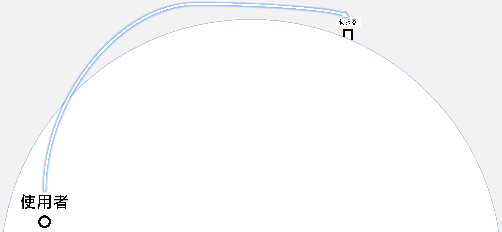
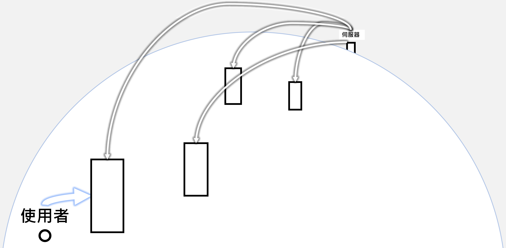
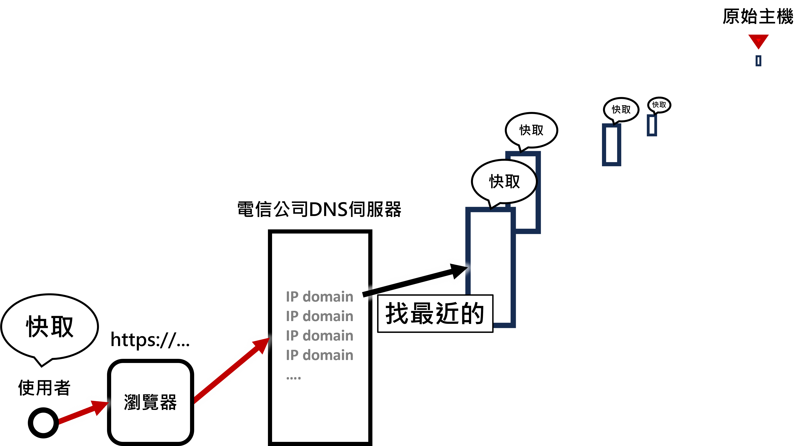

# CDN
<b style="font-size:1.2rem">CDN</b> 全名是 <b>Content Delivery Network (內容傳遞網路)</b>
是一種透過分散式伺服器網路來加快網站或應用程式內容傳送速度的技術。
簡單來說：
* 一般情況下，網站的內容 ( 圖片、影片、CSS、JavaScript等 )
都放在一個伺服器上，但如果使用者離這個伺服器很遠，載入速度就會慢。

    
    ▲ 就像這樣

* 使用 CDN 時，這些內容就會被「複製」到世界各地的多個節點 ( 也叫邊緣伺服器 )
當使用者訪問網站時，CDN會從最近的節點提供內容，就可以更快、更穩定地載入

    
    ▲ 就像這樣

### 工作流程
1. 使用者在瀏覽器上輸入網址。
    * 瀏覽器先從使用者 ( 本地 ) 快取中加載，如果沒有再繼續往下走
2. 瀏覽器向 DNS 發送請求，查找對應的 IP 地址。
3. CDN 的 DNS 伺服器根據使用者的地理位置 ( 或其他優化策略 )
返回最接近的 CDN 節點的 IP 地址。
4. 使用者的瀏覽器通過這個 IP 地址與最近的 CDN 節點建立連接，
請求內容 ( 例如.圖片、CSS、JavaScript等 )。
5. CDN 節點從自己的快取中提供內容，如果快取沒有再向原始伺服器請求資源。

    
    ▲ 就像這樣

## 分散式伺服器網路
分散式伺服器網路 ( Distributed Server Network )
是一種將伺服器分散在多個物理或虛擬位置的架構
這些伺服器協同工作，共同處理和存儲數據，並向用戶提供服務。
這樣的網路架構通常具備更高的可靠性、可擴展性和容錯性。
    